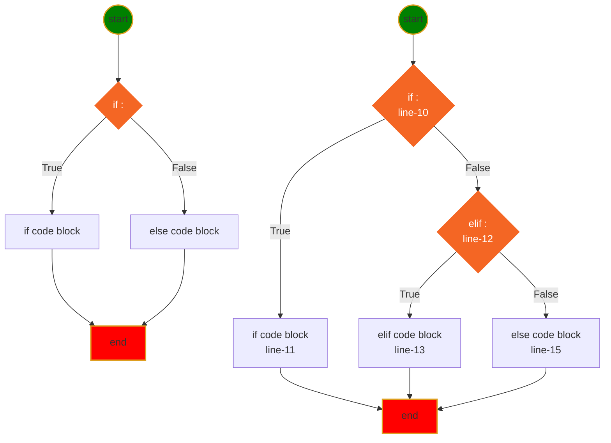
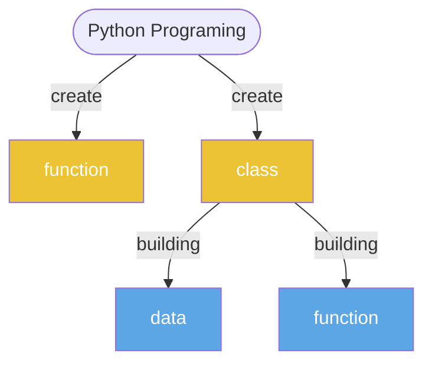
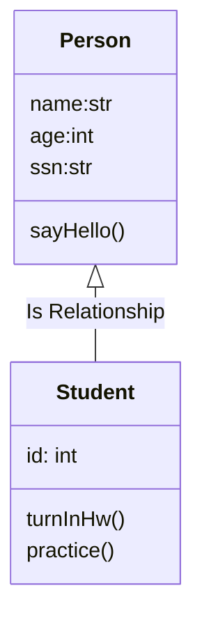

<h1>Python Class Notes</h1>

- [python language basics](#python-language-basics)
- [My First python program](#my-first-python-program)
- [getting start](#getting-start)
- [print](#print)
- [comment](#comment)
- [Variable Naming](#variable-naming)
  - [Variable and memory](#variable-and-memory)
- [Data Type](#data-type)
- [operator](#operator)
- [Execution Control (If-else)](#execution-control-if-else)
- [Loop](#loop)
- [Function](#function)
- [OOP (object oriented programming)](#oop-object-oriented-programming)
  - [class basic:](#class-basic)
  - [dunder function](#dunder-function)
  - [attribute scope](#attribute-scope)
  - [class tricks](#class-tricks)


## python language basics
[calculate triangle area](../src/function01.py)

## My First python program
[hello world](../src/hello.py)

## getting start
❓ How do I open python playground?
✔️ open new terminal
```
C:\Users\12818\workspace\Rodney\python>python
Python 3.9.1 (tags/v3.9.1:1e5d33e, Dec  7 2020, 17:08:21) [MSC v.1927 64 bit (AMD64)] on win32
Type "help", "copyright", "credits" or "license" for more information.
>>>
```
❓ How do I read help document in python
✔️ document for **print** function
```
>>> help(print)
Help on built-in function print in module builtins:

print(...)
    print(value, ..., sep=' ', end='\n', file=sys.stdout, flush=False)
```
❓ How do I find all functions for **str**?
✔️

## print
[print](../src/print.py)
- place holder (%s, %d, %f)
- print with tuple
- formated print: print(f"x={x}") 

* \n is escape sequence, which means a new line character is added
* \t is escape sequence, which means a tab character is inserted
  
## comment 
[comment](../src/comment.py)
* single line comment: #
* multiple lines comment: """, '''


## Variable Naming
1. variable name cannot start with number
2. variable can be combination of letters and numbers _, a~z, A~Z, 0~9, ❗️⚡️no other special characters
3. don't use reserved keywords as variable name
   


[Python Keywords](https://realpython.com/python-keywords/#:~:text=%20Python%20Keywords%20and%20Their%20Usage%20%201,are%20used%20for%20control%20flow%3A%20if%2C...%20More%20)

4. Avoid using existing function name as your variable name.
otherwise, your python builtins functions no longer works the way you expected.

5. ☝️class name, function name and attribute name, all of them must follow the rules above☝️.
   
### Variable and memory


## Data Type
* [Numbers](../src/number.py)
    - int: a=4
    - float: a=3.4
    - complex: c=4-3j
* [String](../src/string1.py)
    - string is iterable
    - string slicing: [[start]:[end]:[step]]
    - String operator +, *
    - as function str(object)
    - string functions
* [Tuple](../src/tuple.py)
    - tuple is iterable
    - tuple is immutable
    - tuple slicing: tuple1[[start]:[end]:[step]]
    - tupler operator +, *
    - as function: tuple(iterable)
    - tuple functions ()
* [List](../src/list.py)
    - list is iterable
    - list is mutable
    - list slicing: list1[[start]:[end]:[step]]
    - list operators +, *
    - modify list
    - as function: list(iterable)
    - list functions (append, insert)
* [Set](../src/set.py)
    - set is iterable
    - set is mutable
    - set operators: &, |, <, >, ==
    - modify set
    - as function: set(iterable)
    - set functions ()
* [Dictionary](../src/dictionary.py)
    - iterable
    - mutable
    - no duplication
    - ** operator
    - function (items, keys, values, clear, pop)


## operator
* Arithmatic Operator: +; -; *; /: %; **;//(floor divisor)
    [arithmatic.py](../src/arithmatic.py)
* Assignment Operators: =; +=; -=; *=; /=; %=; **=; //=
    [assignment.py](../src/assignment.py)
* Comparison Operators: ==, !=, <, >, <=, >=
    [comparison.py](../src/comparison.py)
* Logical Operator: and, or, not
    [logical.py](../src/logical.py)
* Membership Operator: in, not in
    [membership.py](../src/membership.py)
* Identity Operator: is, is not
    [identity.py](../src/identity.py)
* Ternary operator: if-else, and-or
    [ternary.py](../src/ternary.py)
* Multiple times operator: **
    [others.py](../src/others.py)
* Bitwise Operator: &, |, ^, <<, >>
    [bitwise.py](../src/bitwise.py)

## Execution Control (If-else)
Execution control



* [If without else](../src/if-else01.py)
* [if with elif and else](../src/if-else02.py)


## Loop
* For loop
  

* [for/while loop](../src/loop.py)

* While loop
    
* Python does NOT support do-while loop, but you can simulate do-while.
    
```
while loop has 3 part:
1. initialize variable, a=0
2. variable condition, a<10
3. adjust variable, a +=1
```



---
[Table of Contents](#table-of-contents)

## Function
A function is a block of organized, reusable code 
that is used to perform a single, related action.

    - def: use Python reserved keyword
    - function name: you can name a function whatever you want but follow the variable rules.
    - () you have to include () pair in you function definition
    - : must end your definition with :.
    - the function body must indent
    - ❗️⚡️function can be overridden
    - 😄return more than one value
    - 💡Single response, do single thing
    - ❗️❗️call a function by function name and () no matter it has arguments or not, and arguments if thers is any

$$\underbrace {def}_{keyword} \underbrace {circle \_area}_{function \space name} \left(\underbrace {a, b,c ...}_{positional\; args} * \underbrace {e=None, f=200}_{keyword\;args}\right) \underbrace {:}_{eol}$$

* [function.py](../src/function.py)
* [argument.py](../src/argument.py)
* [raise error when radius<0](../src/circle.py)
* [understand if __name__ == '__main__':](../src/testCircle.py)
>😄avoid running test code block from import
* [add try-except block](../src/tryexcept.py)
* [Define inner functions inside outer function](../src/functionInFunction.py)
* [return function dynamically](../src/returnFunction.py)
>part of Functional programming which focus on goal
* [Functional programming basic](../src/passFunction.py)
## Unittest
❓ What is unittest?
✔️A unit is a specific piece of code to be tested, such as a function or a class. Unit tests are then other pieces of code that specifically exercise the code unit with a full range of different inputs, including boundary and edge cases.* 

* 😢👎unittest cannot find the file unless
    1. test file name match the pattern
    2. test file located on right folder
    3. unittest always find test file from current running folder
    4. 👎module and function can be found in the module
    5. 👎module must be no compiler error
    6. make sure there is no typo on module
```py
import unittest
from src.circle import circleArea
from math import pi

class TestCircleArea(unittest.TestCase): # must inherits from unittest.TestCase
    def test_area(self):
        self.assertEqual(pi,circleArea(1))
        self.assertEqual(0,circleArea(0))
        self.assertEqual(16.619025137490002,circleArea(2.3))
```

* Configure unittest in VS code:
Right-Click inside Editor window > Command Palette... > Python Configure Test > unittest > test_*.py 

## OOP (object oriented programming)
[](images/oop.png)
❓ What is abstractons?
✔️ class in python is an abstraction of object in real world which includes 1.name 2.field 3.function

❓ What is inheritence?
✔️subclass inherits everything defined in superclass

[inheritence](../src/class/student.py)

❓What is encapsulation?
✔️A private variable that cannot be accessed outside, so the attribute canot be changed

❓What is polymorphism?
✔️
### class basic:
[Simple Class](../src/class/class01.py)
[Define a function outside of class](../src/class/class02.py)
[Define a function inside class and self](../src/class/class03.py)
[Define __init__(self, name)](../src/class/class04.py)
[Use keyword argument in __init__](../src/class/class05.py)
[Encapsulation](../src/class/class07.py)
[use property](../src/class/class08.py)

### dunder function
[__repr_(), __str__(), __len__()](../src/class/class06.py)
[understand __new__(), __init__()](../src/class/class09.py)
1. avoid override __new__(cls)
2. if you do, make sure it is the same argument as __init__()
3. __new__() return an object
4. __init__() return None
[Good sample for voerride __new__](../src/class/class10.py)[Class enumeration for multiple items]
[__iter__,__next__](../src/class/class15.py)

### attribute scope
[class level attribute](../src/class/class11.py)
[instance level attribute](../src/class/class12.py)
[class level constant attribute](../src/class/enum1.py)

### class tricks
[define outside function for class](../src/class/class13.py)
[internal function call another internal function](../src/class/class14.py)
